# 🌐 The Ultimate Guide to Realtime Web Communication
### WebSockets, WebRTC, WebTransport, and SSE

In the modern web, "refreshing the page" is a thing of the past. Users expect live updates, instant notifications, and real-time collaboration. But how does the browser talk to the server (or other browsers) instantly?

This guide breaks down the four pillars of realtime web communication: **Server-Sent Events (SSE)**, **WebSockets**, **WebTransport**, and **WebRTC**. We'll cover **how** they work, **where** to use them, **why** you should choose one over the other, and visualize their **system design**.

---

## 1. Server-Sent Events (SSE) 📡

### What & How
SSE is a standard that allows servers to push data to the client over a standard HTTP connection. Unlike polling, where the client keeps asking "is there new data?", SSE establishes a single long-lived HTTP connection where the server sends a stream of data whenever it's available.

*   **Protocol**: HTTP/1.1 or HTTP/2
*   **Direction**: Unidirectional (Server ➝ Client)
*   **Format**: UTF-8 Text (usually JSON)

### System Design
The client opens a connection, and the server keeps it open, sending "events" as text chunks.


### 💻 Code Example: The `EventSource` API

```javascript
// 1. Connect to the server
const eventSource = new EventSource('/my-stream-url');

// 2. OPEN: Connection established
eventSource.onopen = () => {
  console.log('✅ Connection to server opened.');
};

// 3. MESSAGE: Receive data
eventSource.onmessage = (event) => {
  const data = JSON.parse(event.data);
  console.log('📩 New event received:', data);
};

// 4. ERROR: Handle connection issues
eventSource.onerror = (error) => {
  console.error('❌ EventSource failed:', error);
  // EventSource automatically attempts to reconnect
};

// 5. CLOSE: Stop listening
// eventSource.close();
```


### Where & Why
*   **Use Cases**:
    *   **News Feeds / Stock Tickers**: You just need to *receive* updates, not send them back.
    *   **Notification Systems**: Like the bell icon on social media.
    *   **CI/CD Logs**: Watching a build progress in real-time.
*   **Why use it?**:
    *   ✅ **Simple**: Uses standard HTTP. easy to implement on both ends.
    *   ✅ **Auto-reconnection**: Browsers handle reconnections automatically.
    *   ✅ **Firewall Friendly**: It's just HTTP.

---

## 2. WebSockets 🔌

### What & How
WebSockets provide a full-duplex communication channel over a single TCP connection. It starts as an HTTP request (the "handshake") and then "upgrades" to the binary WebSocket protocol. Once established, both client and server can send data at any time.

*   **Protocol**: WS (WebSocket) or WSS (WebSocket Secure) over TCP
*   **Direction**: Bidirectional (Server ⇄ Client)
*   **Format**: Text or Binary

### System Design
The handshake allows the server to switch protocols without opening a new port.

```mermaid
sequenceDiagram
    participant Client
    participant Server
    
    Client->>Server: HTTP GET /chat (Upgrade: websocket)
    Server-->>Client: 101 Switching Protocols
    
    Note over Client, Server: 🟢 Persistent TCP Connection Established
    
    Client->>Server: "Hello!"
    Server-->>Client: "Hi there!"
    Server-->>Client: "How are you?"
    Client->>Server: "Good!"
```



### 💻 Code Example: The `WebSocket` API

```javascript
// 1. Connect
const socket = new WebSocket('ws://localhost:8080');

// 2. OPEN: Socket is ready
socket.onopen = (event) => {
  console.log('✅ WebSocket is open now.');
  // Send a message
  socket.send('Hello Server!'); 
};

// 3. MESSAGE: Receive data
socket.onmessage = (event) => {
  console.log('📩 Message from server:', event.data);
};

// 4. ERROR: Handle errors
socket.onerror = (error) => {
  console.error('❌ WebSocket error:', error);
};

// 5. CLOSE: Connection closed
socket.onclose = (event) => {
  console.log('⚠️ WebSocket closed:', event.reason);
};
```


### Where & Why
*   **Use Cases**:
    *   **Chat Applications**: WhatsApp Web, Slack, Discord.
    *   **Multiplayer Games**: Real-time movement and state synchronization.
    *   **Collaborative Editing**: Google Docs / Figma (seeing cursors move).
*   **Why use it?**:
    *   ✅ **Low Overhead**: Headers are small after the handshake.
    *   ✅ **Real Two-Way**: Essential for interaction.
    *   ✅ **Widely Supported**: Runs everywhere.

---

## 3. WebTransport 🚀

### What & How
WebTransport is the modern successor to WebSockets, built on top of **HTTP/3** and **QUIC**. It solves the "Head-of-Line Blocking" problem of TCP (where one lost packet delays everything). It supports both reliable streams (like TCP) and unreliable datagrams (like UDP) over a single encrypted connection.

*   **Protocol**: HTTP/3 (QUIC) over UDP
*   **Direction**: Bidirectional (Server ⇄ Client)
*   **Format**: Binary

### System Design
Multiple streams can be opened over one connection. If one stream drops a packet, others verify independently.


### 💻 Code Example: The `WebTransport` API

```javascript
async function initWebTransport() {
  // 1. Connect
  const transport = new WebTransport('https://example.com/webtransport-endpoint');

  // 2. READY: Wait for connection
  await transport.ready;
  console.log('✅ WebTransport ready!');

  // 3. STREAMS: Open a reliable stream
  const stream = await transport.createBidirectionalStream();
  const writer = stream.writable.getWriter();
  await writer.write(new TextEncoder().encode("Hello reliable world"));

  // 4. DATAGRAMS: Send unreliable data (fast!)
  const datagramWriter = transport.datagrams.writable.getWriter();
  datagramWriter.write(new TextEncoder().encode("Player Position: 10,20"));

  // 5. CLOSED: Handle disconnection
  transport.closed.then(() => {
    console.log('⚠️ Connection closed cleanly.');
  }).catch((error) => {
    console.error('❌ Connection closed abruptly:', error);
  });
}
```


### Where & Why
*   **Use Cases**:
    *   **High-End Gaming**: Sending player inputs instantly where occasional packet loss is okay.
    *   **Live Media Ingestion**: Uploading video streams with low latency.
    *   **IoT Telemetry**: Sending massive amounts of sensor data efficiently.
*   **Why use it?**:
    *   ✅ **No Head-of-Line Blocking**: One laggy stream doesn't stop the rest.
    *   ✅ **Datagram Support**: Can send "fire and forget" packets like UDP.
    *   ✅ **Modern Performance**: Built for high-speed, lossy networks.

---

## 4. WebRTC (Web Real-Time Communication) 📹

### What & How
WebRTC is designed for **Peer-to-Peer (P2P)** communication. The browser talks directly to another browser, bypassing the server (mostly). It allows high-throughput video, audio, and arbitrary data transfer.

*   **Protocol**: UDP (mostly) + ICE/STUN/TURN for connectivity
*   **Direction**: P2P (Client ⇄ Client)
*   **Format**: RTP (Media) / SCTP (Data)

### System Design
WebRTC is complex because browsers are often behind NATs (routers). We need a Signaling Server to introduce the peers, and STUN/TURN servers to find a path.

```mermaid
sequenceDiagram
    participant PeerA
    participant SignalingServer
    participant PeerB
    
    PeerA->>SignalingServer: "I want to call PeerB" (SDP Offer)
    SignalingServer->>PeerB: "PeerA is calling" (SDP Offer)
    PeerB->>SignalingServer: "Accept" (SDP Answer)
    SignalingServer->>PeerA: "Accepted" (SDP Answer)
    
    Note over PeerA, PeerB: ⚠️ Exchange ICE Candidates (IP:Port) via Signal Server
    
    PeerA-->PeerB: 🟢 Open P2P Channel (UDP)
    PeerB-->PeerA: 🟢 Open P2P Channel (UDP)
    
    Note over PeerA, PeerB: Video/Audio flows directly!
```



### 💻 Code Example: The `RTCPeerConnection` API

```javascript
// 1. Setup Config (STUN servers found a path)
const config = { iceServers: [{ urls: 'stun:stun.l.google.com:19302' }] };
const peerConnection = new RTCPeerConnection(config);

// 2. ICE CANDIDATE: Found a network path
peerConnection.onicecandidate = (event) => {
  if (event.candidate) {
    // Send this candidate to the other peer via your Signaling Server
    sendToOtherPeer('candidate', event.candidate);
  }
};

// 3. CONNECTION STATE: Monitor health
peerConnection.onconnectionstatechange = () => {
    console.log('🔌 Connection State:', peerConnection.connectionState);
};

// 4. TRACK: Receive video/audio stream
peerConnection.ontrack = (event) => {
  console.log('🎥 Received remote stream');
  const remoteVideo = document.getElementById('remoteVideo');
  remoteVideo.srcObject = event.streams[0];
};

// 5. Add local stream to connection
// const stream = await navigator.mediaDevices.getUserMedia({ video: true });
// stream.getTracks().forEach(track => peerConnection.addTrack(track, stream));
```


### Where & Why
*   **Use Cases**:
    *   **Video Conferencing**: Zoom, Google Meet, Microsoft Teams (Web).
    *   **P2P File Sharing**: ShareDrop, Snapdrop.
    *   **Cloud Gaming**: Stadia, GeForce Now (streaming video to you).
*   **Why use it?**:
    *   ✅ **Lowest Latency**: Direct connection = speed.
    *   ✅ **Server Load**: Heavy media traffic doesn't go through your server (unless using TURN).
    *   ✅ **Secure**: Mandatory Encryption (DTLS/SRTP).

---

## ⚡ Summary & Comparison Table

| Feature | SSE | WebSocket | WebTransport | WebRTC |
| :--- | :--- | :--- | :--- | :--- |
| **Protocol** | HTTP (TCP) | TCP | QUIC (UDP) | UDP / TCP |
| **Direction** | One-Way (Server->Client) | Bidirectional | Bidirectional | P2P (Client<->Client) |
| **Latency** | Low | Low | Ultra Low | Lowest |
| **Complexity** | ⭐ Easy | ⭐⭐ Medium | ⭐⭐⭐ Hard (New) | ⭐⭐⭐⭐⭐ Very Hard |
| **Primary Use** | Feeds, Notifications | Chat, State Sync | Games, Streaming | Video Calls, P2P |

### Which one should I choose?

1.  **Just need updates?** (News, Scoreboard) -> **SSE**.
2.  **Need 2-way chatter?** (Chat app, trading) -> **WebSockets**.
3.  **Video call or P2P file share?** -> **WebRTC**.
4.  **Next-gen game networking?** -> **WebTransport**.

---

*[Notes-for-Computer-Science](https://github.com/utkarsh-roy/Notes-for-Computer-Science) repository.*
